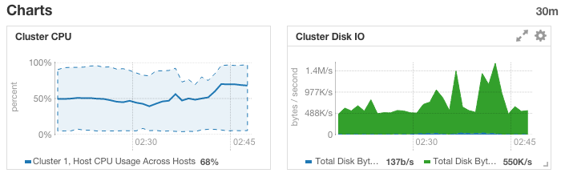
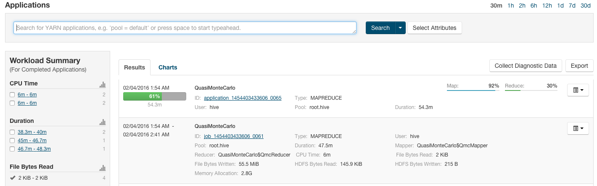
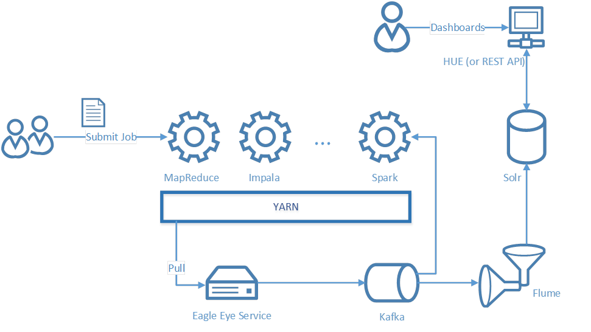
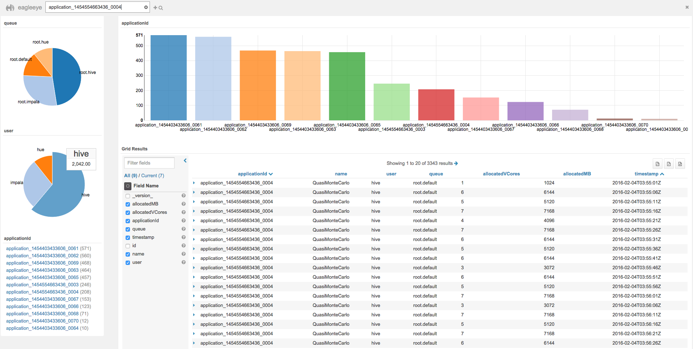
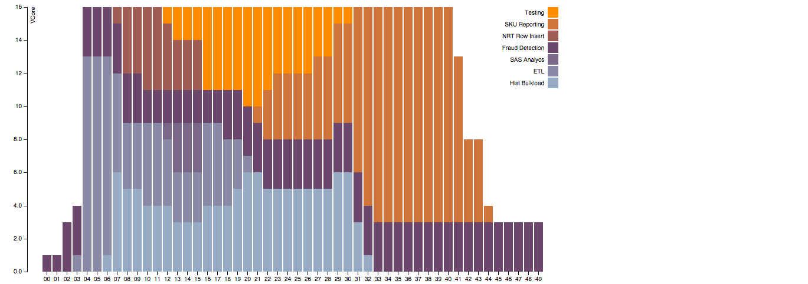

# Eagle Eye
An app built on **Cloudera Enterprise** for tracking jobs that run in YARN framework. Those runtime "logs" are important, as they can be used for:

* real-time monitor, check whether the most critical jobs have gained enough resources;
* resource usage summary reporting at job/queue granularity, get the deeper insights of your cluster;
* resource allocation snapshot, quickly check which user, job, or queue is hogging resources for any time period. 

As the best Hadoop administration console, Cloudera Manager can fulfill almost all administration requirements, e.g. monitor cluster overall resources usage, service/host status, etc.



In some circumstances, customers may trace back to check the job status given a specific time window. Currently, they always go to "yarn application" console



However, there is only summarized information there, it's NOT that straightforward to reconstruct what happened at a specific time spot. To facilitate it, a better solution would be to capture the behavior of a job during its whole lifecycle, index them for searching, and make them available to other analytic applications.

#### 1. Architecture



The high-level diagram above illustrates a simple setup. More specifically, **Eagle Eye service** will retrieve all running application metrics and send them to **Kafka** Channel, which in turn passes them to a MorphlineSolr sink in **Flume** agent. MorphlineSolr parses the messages, converts them into Solr documents, and sends them to **Solr** server. After the indexed documents appear in Solr, dashboards (e.g. **Hue**, or other dashboards) can be built for visualization. Also the metrics data can be sent to **Spark** (and/or Spark Streaming) for more advanced analysis.

In case there all no Kafka brokers deployed yet, Eagle Eye service is able to send the metrics to Flume (through [Http source](https://flume.apache.org/FlumeUserGuide.html#http-source)) directly.

**Application metrics (Resource Manager REST API) break down**

```xml
<app>
    <id>application_1326815542473_0001</id>
    <user>user1</user>
    <name>word count</name>
    ...
    <allocatedMB>0</allocatedMB>
    <allocatedVCores>0</allocatedVCores>
    <runningContainers>0</runningContainers>
    <memorySeconds>151730</memorySeconds>
    <vcoreSeconds>103</vcoreSeconds>
</app>
```

For simplicity, we only extract **allocatedMB** and **allocatedVCores** to track CPU/Memory usage of a job.

#### 2. Prerequisite

Given the requirement discussed above, we need at least Solr, Kafka, and Flume. Fortunately All in one, they are already in CDH (with **professional support**). So any **Java developer** with **Cloudera Enterprise** at hand is able to implement this prototype from scratch within 1 day. What you have to do is to write some simple Java code and [morphline](https://github.com/yeleid/eagleeye/blob/master/bin/flume/morphline.conf)/flume configurations. 

**Deploy Kafka**

Add Kafka service in Cloudera Manager Admin console


Create a topic for eagle eye

    bin/kafka/create_topic.sh
    After you create the topic, you can run bin/kafka/list_topics.sh to see whether the topic is created correctly and it should display like below:
    eagleeye

**Deploy Solr**

Add solr service in Cloudera Manager Admin console


    bin/solr/create_collection.sh 
    create solr collection...
    Uploading configs from /tmp/eagleeye_configs/conf to 172.31.13.75:2181/solr. This may take up to a minute.

Later you may consider Solr data purge for storage/query efficiency via [Solr alias](http://blog.cloudera.com/blog/2013/10/collection-aliasing-near-real-time-search-for-really-big-data/).

**Deploy Flume**

To get metrics from Kafka, you may use [configuration](https://github.com/yeleid/eagleeye/blob/master/bin/flume/properties/flume-kafka.properties)

```vim
a1.sinks.k1.type = org.apache.flume.sink.solr.morphline.MorphlineSolrSink
a1.sinks.k1.morphlineFile = bin/flume/morphline/morphline-json.conf
...
# Use a channel which buffers events in memory
a1.channels.c1.type = org.apache.flume.channel.kafka.KafkaChannel
a1.channels.c1.parseAsFlumeEvent = false
...
```

This flume agent will consume data from Kafka directly and leverage morphline to index data in Solr in near real time (NRT). To Start flume agent a1, run the command below:

    bin/flume/ng-flume.sh

To receive metrics directly from Eagle Eye service, you may use [configuration](https://github.com/yeleid/eagleeye/blob/master/bin/flume/properties/flume-http.properties)

```vim
a1.sinks.k1.type = org.apache.flume.sink.solr.morphline.MorphlineSolrSink
a1.sinks.k1.morphlineFile = bin/flume/morphline/morphline-csv.conf
...
a1.sources.r1.type = http
a1.sources.r1.port = 4140
```

#### 3. Eagle Eye Setup & Demonstration

Let's first look into the properties eagle eye use to configure the app dynamically:

```properties
# define resource manager address where to retrieve application information
yarn_applications_path=/ws/v1/cluster/apps?states=RUNNING
rm_address=http://172.31.13.75:8088

# define the sampling frequency, the format of metrics, and how to publish metrics
schedule_period=5
producer=http,logger
# producer=kafka,logger
format=csv
# format=json

# define the kafka broker and topic properties
kafka_topic=eagleeye
kafka_broker_list=172.31.13.76:9092,172.31.13.77:9092,172.31.13.78:9092

# define the http server
http_server=http://172.31.13.75:4140
```

By now, environments for eagle eys are all set, and you can start this app by typing the command as follows:

    bin/eagleeye.sh 
    16/02/04 01:40:28 INFO solutions.Main: Eagle eye starts monitoring ...

Eagle eye is good to go, you can run command bin/job-submit.sh to submit several jobs on behalf of different users, e.g. hue, hive, and impala. Every 5 seconds, eagle eye will pull information from Resource Manager, parse it and publish the final metrics into Kafka. During the period, you may see the console logs like:

    16/02/04 01:54:09 INFO solutions.Publisher: [{"timestamp":"2016-02-04T01:54:08Z","queue":"root.hive","allocatedMB":1024,"allocatedVCores":1,"applicationId":"application_1454403433606_0061","user":"hive","name":"QuasiMonteCarlo","id":"application_1454403433606_0061$1454550848874"}]

To visualize the metrics, we use Hue, the easiest way to build custom dashboards:



Since the data are all in CDH, with standard/open protocol, you can easily retrieve the partition and build a more dedicated dashboards, e.g. using [d3](http://d3js.org/) library.



#### 4. References

```vim
Flume solrsink: https://flume.apache.org/FlumeUserGuide.html
Cloudera distribution of Apache Kafka: http://www.cloudera.com/documentation/kafka/latest/topics/kafka_packaging.html
Yarn RM REST api: https://hadoop.apache.org/docs/current/hadoop-yarn/hadoop-yarn-site/ResourceManagerRest.html
```

    


    